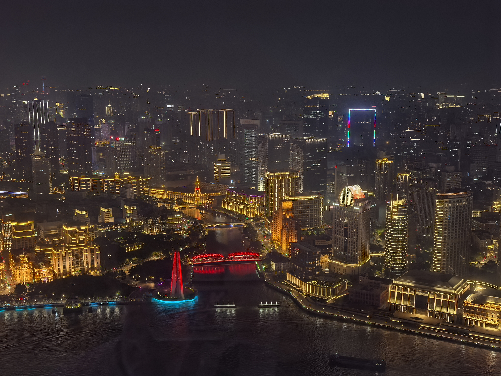
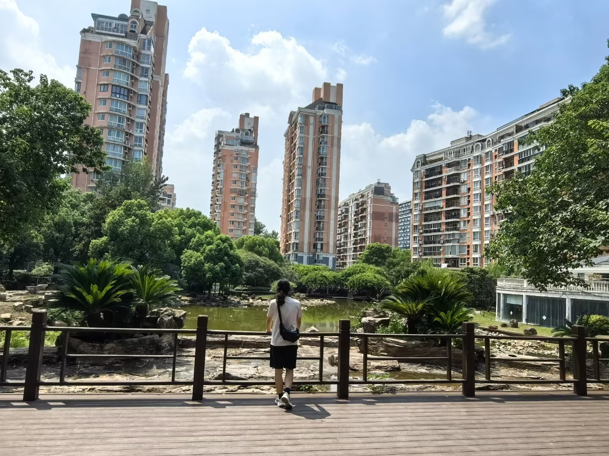
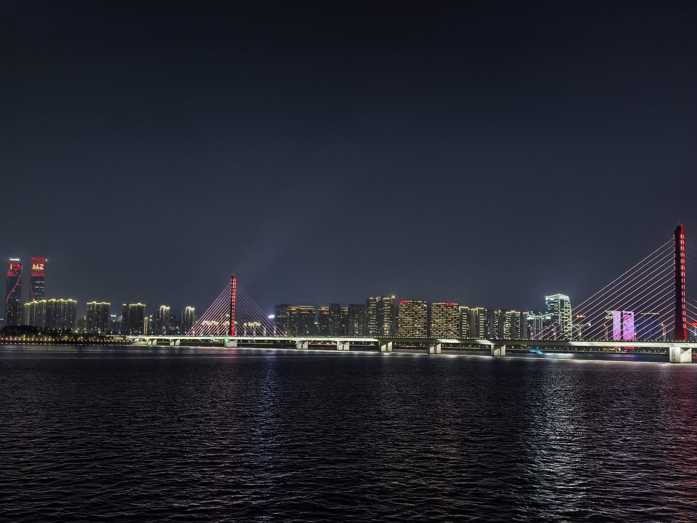

## 前言

旅行的意义是什么？我是说，在技术无所不能的前夕，互联网可以找到远比个人旅行能获取的更多信息，纪念品可以在网络上购到，占据大多数人旅行之大部分的人景合照可以由ps技术得到或ai生成。虽然我也同意目前技术还做不到完美，但倘若——我们就作这样的假设：技术若真发展到完美的地步，那么旅行的意义还余下些什么？毕竟大多数人的旅行基本只有拍照、品尝与观景。

有一个颇有哲学含义的定理这样是说的（米田嵌入），$A\cong B\Leftrightarrow \mathrm{Hom}(-, A)\cong\mathrm{Hom}(-, B)$。我想开始用感性的语言去解释这样的定理，在以往我可能会反对自己这种做法，但现在我的思想有了变化。

我们不妨把这叫作米田信夫的哲学：一件事物之完整内涵无外乎对其一切的感知。风是客观存在的事物，而我走出图书馆，感受到了面颊的吹拂，便知道了风的存在；我看到树的摇曳，便知道了风的方向；如果我还恰好站在老家的麦田中，那风便拥有了形状……如果有人能穷尽一切的途径去观察这风，那他不多不少正好可以还原这风的整个面貌。

<!--more-->

## 上海

上海是我一直想去的地方之一，但是并没有一个很明确的原因，因为我并不喜欢过于繁华的街道。三年前如果有人问我在静谧的乡村和繁华的城市之间选择一个作为居住地，我会毫不犹豫地选择乡村。一方面是受父母辈的影响，我的父母都来自农村，而且多次与我谈到退休后的生活，他们都更想翻修农村的老房子后在那边生活。我从小几乎没出过省，甚至连学校所在的县都没怎么出过，整个人生轨迹就是从遂宁迁出后在罗江县城学校附近、金山镇口与成都的住处辗转，就仿佛我高中那三点一线的日常放大版，扩大到以年为单位的人生而已。因此我便凭着一些猜测加模糊的印象，认为乡村的生活应该更合乎我的口味。直到最近我才开始质疑起自己，真的是这样吗？

我非常喜欢一款游戏《镜之边缘》，小时候电脑配置不够，只能玩一代，二代根本启动不了，只能在视频网站上看宣传片和实况过过瘾。后来放假时到姨夫家中蹭电脑玩，他们家的电脑配置稍微好一点，我开着最低的画质和分辨率玩了一部分剧情，收假后还回味无穷。我永远忘不了一代结束时摄像机抬起后伴随《Still Alive》展开的镜之城夜景，当时不知道怎的就触动了我的神经，下面许多楼房都是之前关卡所在，现在想来，正是那种面对着由海量与自己相关的细节组成的世界。后来寻遍天下游戏，几乎找不到第二款能给我同样感觉的游戏。后来上大学换了电脑，终于能正常游玩催化剂，我是买下来后反复把玩，一款半成品几乎没有实质的开放世界的单机游戏能玩上两三百小时，这在我其他游戏时间中实属罕见。

这次来到上海，回想起游戏中那个令我无法忘怀的镜头，虽然知道东方明珠人多得骇人，我还是执意跟同伴说想上去看看。幸好同伴也没有多抱怨，到地方就开始排队，后来排了快三个小时才终于登上塔顶，尽管天气也很炎热，同伴却也没说什么（旅行选好同伴真的很重要，换作别人估计要吵架了）。我在塔上转了若干圈，因为手机摄像头不好，让同伴帮着拍了几张俯瞰图，算是了了童年的一桩心愿。又去上面几层的玻璃栈道看了一下，可惜玻璃已经脏得看不清下方，只有模糊的光圈，不到一小时便又下了来。

我在东方明珠上亲眼看到了屡次出现在我梦中的繁华，晚上躺在床上，却总觉和我的期待略有偏差。辗转反侧思来想去，认为是上海这种至极的繁华和我距离太遥远了，不像是我的生活，或者与我能有联系。有时候梦想照进现实，才发现这多年梦想不是自己想要的。

后来几天还去了爱情公寓的外景取景地，拍了照片，算是打了卡，不过打卡并未给我留下什么特殊的印象，看来有些感动只适合存在自己的脑海里。

## 杭州

这次出游，杭州给了我莫大的惊喜。本来杭州对这次旅行来说只是一个中转地，从上海到德清比赛回来，到杭州比较近，机票也较便宜而已。杭州的美食极其难吃，尤其是最出名的几样：醋鱼、东坡肉等，令人很失望，这段就不再写了。

最令我惊讶的是城市阳台这里。我在这里找到了东方明珠上缺失的那块感觉.

杭州是一个同样繁华的城市，但在城市阳台与对岸隔江相望，却给了我在上海无论如何也找不到的安心感。虽然东方明珠与外滩也有一江之隔，但两岸都太喧闹，甚至珠江水面都难得平静。而钱塘江的静谧却巧妙地嵌入到两岸的繁华中，中间的大桥像两条波涛汹涌的大河间的涓涓细流，沟通着两边的繁忙和成千上万的故事。

我当晚在城市阳台上站了很久，用我的手机也好同伴的手机也好，无论如何也拍不出我当时心头的激动，在我看来，这完全就是我在催化剂的夜晚获得的感动，一点不差。

城市阳台的人并不多，甚至可以说安静，我可以随意在附近走动和驻足，不像外滩需要见缝插针地找角度拍照。我有一瞬间感觉这就是我想定居的城市，这个意境，就是我前十余年日有所思夜有所梦所苦苦寻找的。只有这时才真正体会到词不达意之人的悲哀。

后来我又想了想，确信我所期待的正是这种在某处安静的角落观察城市繁华的机会，是这种置身事外的逍遥。我希望我能处在一个足够热闹的世界，但并不想置自身在其中。当我自己真正站在人潮人海中时，就像在上海外滩那天一样，我会感到迷茫，甚至于惶恐，感觉不到自己的存在。对于自己周围的一亩三分地，我更想安静、简单一点。

当然，我以后是否在这边定居还是未知数，杭州的食物太难吃，而且离四川确实比较远。这些都是后话了。
